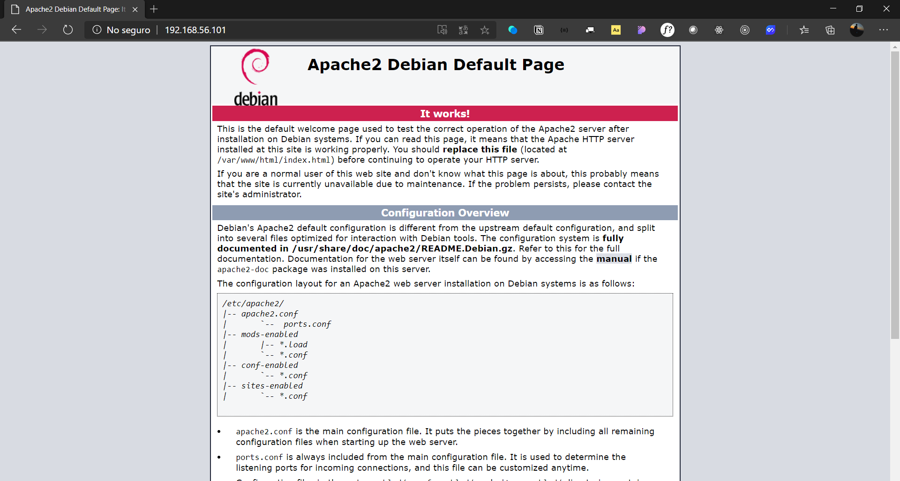

# Debian 10 - Apache Server + Git Clone


Created: Nov 2, 2020 2:35 PM
Tags: Special Event, Work

# Instalar Apache

Apache será nuestro servidor web donde alojaremos nuestro sitio web. Con el gestor de paquetes `apt-get` instalamos apache con el siguiente comando:

```
apt-get install apache2
```

Se mostrara algo como esto:


# Instalar herramienta UFW

UFW nos permitirá bloquear o permitir con un firewall las conexiones que especifiquemos. Lo instalamos de la siguiente manera:

```
apt-get install ufw
```

Veras algo como esto:


## Habilitando acceso con UFW

Habilitamos TCP en el puerto 80 para que el firewall no nos impida la conexión a nuestro servidor apache. Y esto se hace con el siguiente comando:

```
ufw allow 80/tcp
```

Como resultado veras esto:


Luego debes habilitar UFW con el comando:

```
ufw enable
```

Si deseas ver si lo habilitaste correctamente puedes escribir:

```
ufw status
```

Obteniendo el resultado:


# Instalando NetTools

NetTools es una herramienta que nos da información de la red, lo cual nos servirá para ver la IP de nuestro servidor apache y poder acceder a la web. Instalamos usando el siguiente comando:

```
apt-get install net-tools
```

Deberías ver la instalación ejecutándose de esta forma:


# Viendo nuestra IP con NetTools

```
ifconfig
```

> Con este comando podremos ver la IP de nuestra maquina la cual usaremos para ver la web alojada en Apache

Veras algo como esto:


> En este caso vemos que la IP es 192.168.56.101

# Visualizar la Web Alojada

Apache trae un web integrada por defecto así que para ejemplo podemos verla simplemente escribiendo la dirección IP de nuestro Servidor en el navegador de la siguiente forma:



> Como puedes ver nos muestra el sitio web alojado en Apache

# Instalando Git

Git es un gestor de versiones así que junto a Apache podremos usarlo para clonar un repositorio en nuestra carpeta de Apache para poder visualizar la web con nuestro servidor.

Instalamos Git con el comando:

```
apt-get install git
```

Veras esto durante la instalación:


# Cambiar o Agregar una Web a nuestro Servidor Apache

Las web alojadas en la ruta raíz de nuestro Apache se encuentran en `/var/www/html/` . En esta ruta podremos guardar nuestra Web reemplazando el archivo `index.html` que esta dentro de esta ruta o bien simplemente crear una carpeta con la web dentro para acceder a través de ella escribiendo la ruta después de la dirección IP, por ejemplo: `https://192.168.0.1/MiPaginaWeb`

Para acceder a la ruta raíz de Apache lo hacemos de esta manera:

```
cd /var/www/html
```

> Habiendo hecho esto estaremos en la carpeta donde se alojan las web

## Clonando el repositorio de GitHub

Para este ejemplo clonaremos el repositorio de mi GitHub el cual es una pequeña web  que muestra un bonito fantasmita feliz.

Para clonarlo nos vamos a GitHub y copiamos la URL de el repositorio que queremos clonar, en este caso es `[https://github.com/ElvisGmz/Spooky-Ghost-Animated](https://github.com/ElvisGmz/Spooky-Ghost-Animated)` y para ello nuestro comando será `git clone <URL-Repositorio>`. Quedando de esta manera:

```
git clone https://github.com/ElvisGmz/Spooky-Ghost-Animated
```

> Veras que esto nos clona todo el repositorio generando una carpeta llamada en este caso `Spooky-Ghost-Animate`

En esta captura puedes ver el proceso de clonación y los archivos que este contiene dentro:


> Usando el comando `ls` podemos ver que la carpeta creada contiene un index.html lo que significa que solo debemos escribir la carpeta donde esta tal archivo después de la dirección IP para acceder a esta web

# Visualizando la Web clonada del repositorio

Para esto es tan simple como escribir la IP y luego el nombre de la carpeta que contiene el `index.html`. En este caso la dirección para acceder es `[http://192.168.56.101/Spooky-Ghost-Animated/](http://192.168.56.101/Spooky-Ghost-Animated/)` obteniendo el siguiente resultado:


> Como ves funciona perfectamente espero te haya gustado esta lectura.